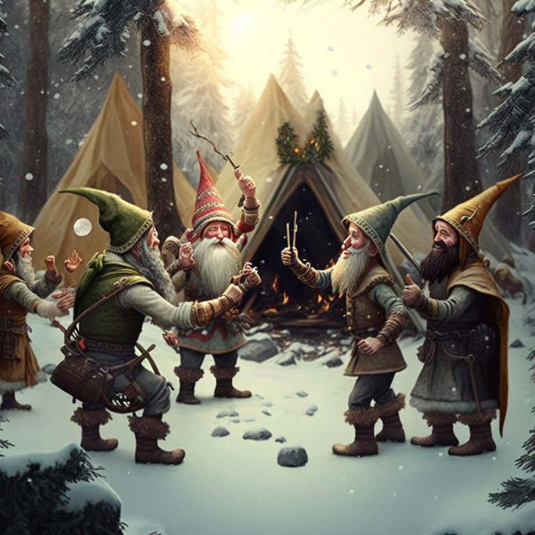

# Day 2 Visualizations

> **NOTE:** Visualizations are often **spoilers** by their very nature.

## Visualizations

1. Bitwig modular synth by [Reddit user Iain\_M\_Norman](https://www.reddit.com/user/Iain_M_Norman)
   ([permalink](https://www.reddit.com/r/adventofcode/comments/zbfe2m/2022_day_02_part1_bitwig_a_rps_scoring_system/)):
   [YouTube video](https://youtu.be/_4uci-mq94Y)

1. "Clock, paper, scissors": Cairo graphics library by [Reddit user Boojum](https://www.reddit.com/user/Boojum)
   ([permalink](https://www.reddit.com/r/adventofcode/comments/zag8vh/2022_day_2_clock_paper_scissors/)):
   [Reddit video](https://v.redd.it/18vrt6vu5g3a1)

## Comics

[Advent of Code comics](https://www.webtoons.com/en/challenge/advent-of-code/list?title_no=713188)
by [Fish N Chips UK](https://www.webtoons.com/en/creator/69q8f)

1. [Rock Paper Scissors](https://www.webtoons.com/en/challenge/advent-of-code/rock-paper-scissors/viewer?title_no=713188&episode_no=31)

## Artwork

1. Midjourney by [Reddit user r\_is\_for\_army](https://www.reddit.com/user/r_is_for_army)
   ([permalink](https://www.reddit.com/r/adventofcode/comments/zewngg/midjourney_artwork_of_day_2_the_rock_paper/)):

   

1. Midjourney by [Reddit user Iain\_M\_Norman](https://www.reddit.com/user/Iain_M_Norman)
   ([permalink](https://www.reddit.com/r/adventofcode/comments/zadxlp/ai_imagine_advent_of_code_2022_day_2/iyle2lw/)):

   

   `starved crazy elf read instruction, scissors lays on the table, big rocks on the floor --v 4`

   Interesting fact: I struggled for a long time, but failed to get Midjourney to generate scissors :(

   \[BJN: ...or a table. 😀]
