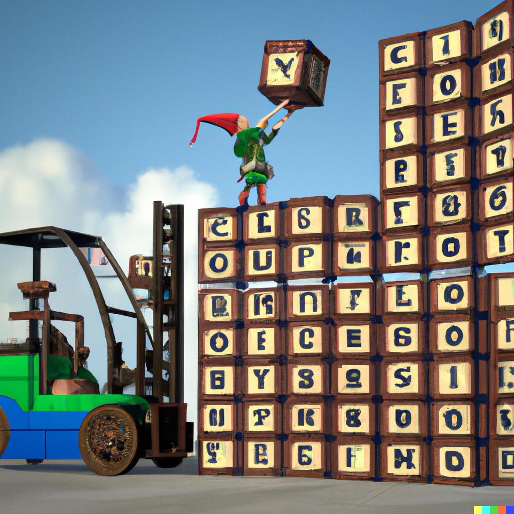
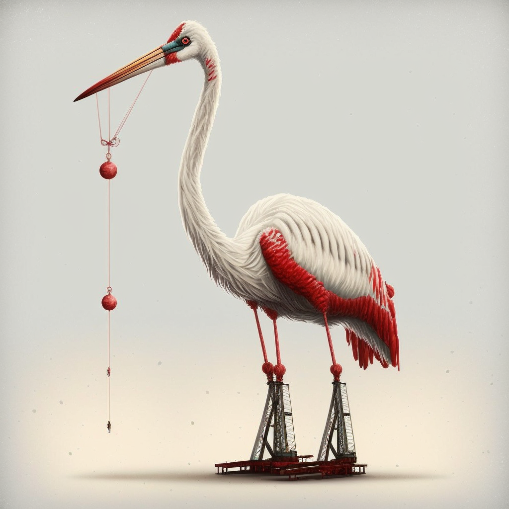

# Day 5 Visualizations

> **NOTE:** Visualizations are often **spoilers** by their very nature.

## Visualizations

1. graphical terminal by [Reddit user naclmolecule](https://www.reddit.com/user/naclmolecule)
   ([permalink](https://www.reddit.com/r/adventofcode/comments/zd7azc/2022_day_5_part_1_python_yet_another_terminal/)):
   [Reddit video](https://v.redd.it/q68p53td434a1)

1. clean visualization by [Reddit user Boojum](https://www.reddit.com/user/Boojum)
   ([permalink](https://www.reddit.com/r/adventofcode/comments/zd2tfz/2022_day_5_the_cratemover_9001/)):
   [Reddit video](https://v.redd.it/1y7ueg7iy14a1)

1. ASCII terminal by [Reddit user p88h](https://www.reddit.com/user/p88h)
   ([permalink](https://www.reddit.com/r/adventofcode/comments/zd2m3f/2022_day5c_raylib_crates_and_cranes/)):
   [YouTube video](https://youtu.be/WhDE_6mOVN0)

## Comics

[Advent of Code comics](https://www.webtoons.com/en/challenge/advent-of-code/list?title_no=713188)
by [Fish N Chips UK](https://www.webtoons.com/en/creator/69q8f)

1. [Supply Stacks](https://www.webtoons.com/en/challenge/advent-of-code/supply-stacks/viewer?title_no=713188&episode_no=34)

## Artwork

1. AI art by [Reddit user iMarioM](https://www.reddit.com/user/iMarioM)
   ([permalink](https://www.reddit.com/r/adventofcode/comments/zcz6hy/2022_day_5_wheres_this_one_go_boss/)):

   

   `Elf controlling a crane moving crates with letters on them into 9 individual stacks photorealistic`

1. "Candy Cane Crane": Midjourney art by [Reddit user Iain\_M\_Norman](https://www.reddit.com/user/Iain_M_Norman)
   ([permalink](https://www.reddit.com/r/adventofcode/comments/zd0jbf/2022_day_5_no_words_needed_today_just_witness_the/)):

   
