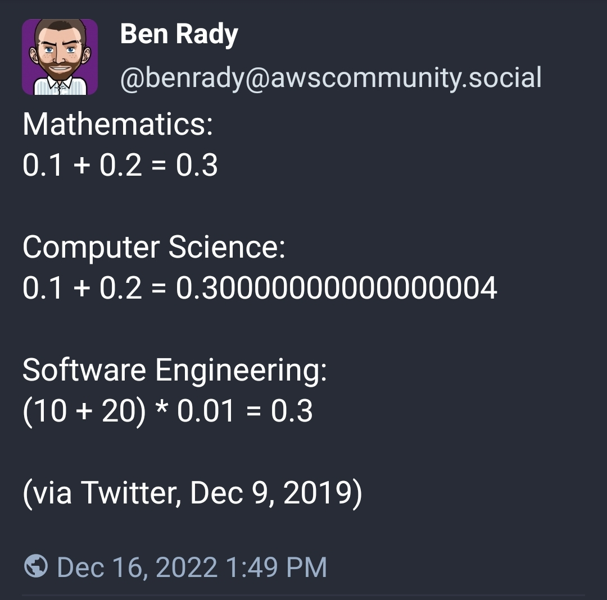

# Day 17: Pyroclastic Flow

## Part One

Your handheld device has located an alternative exit from the cave for
you and the elephants. The ground is rumbling almost continuously now,
but the strange valves bought you some time. It's definitely getting
warmer in here, though.

The tunnels eventually open into a very tall, narrow chamber. Large,
oddly-shaped rocks are falling into the chamber from above, presumably
due to all the rumbling. If you can't work out where the rocks will fall
next, you might be crushed!

The five types of rocks have the following peculiar shapes, where `#` is
rock and `.` is empty space:

```
    ####

    .#.
    ###
    .#.

    ..#
    ..#
    ###

    #
    #
    #
    #

    ##
    ##
```

The rocks fall in the order shown above: first the `-` shape, then the
`+` shape, and so on. Once the end of the list is reached, the same
order repeats: the `-` shape falls first, sixth, 11th, 16th, etc.

The rocks don't spin, but they do get pushed around by jets of hot gas
coming out of the walls themselves. A quick scan reveals the effect the
jets of hot gas will have on the rocks as they fall (your puzzle input).

For example, suppose this was the jet pattern in your cave:

```
    >>><<><>><<<>><>>><<<>>><<<><<<>><>><<>>
```

In jet patterns, `<` means a push to the left, while `>` means a push to
the right. The pattern above means that the jets will push a falling
rock right, then right, then right, then left, then left, then right,
and so on. If the end of the list is reached, it repeats.

The tall, vertical chamber is exactly **seven units wide**. Each rock
appears so that its left edge is two units away from the left wall and
its bottom edge is three units above the highest rock in the room (or
the floor, if there isn't one).

After a rock appears, it alternates between **being pushed by a jet of
hot gas** one unit (in the direction indicated by the next symbol in the
jet pattern) and then **falling one unit down**. If any movement would
cause any part of the rock to move into the walls, floor, or a stopped
rock, the movement instead does not occur. If a **downward** movement
would have caused a falling rock to move into the floor or an
already-fallen rock, the falling rock stops where it is (having landed
on something) and a new rock immediately begins falling.

Drawing falling rocks with `@` and stopped rocks with `#`, the jet
pattern in the example above manifests as follows:

```
    The first rock begins falling:
    |..@@@@.|
    |.......|
    |.......|
    |.......|
    +-------+

    Jet of gas pushes rock right:
    |...@@@@|
    |.......|
    |.......|
    |.......|
    +-------+

    Rock falls 1 unit:
    |...@@@@|
    |.......|
    |.......|
    +-------+

    Jet of gas pushes rock right, but nothing happens:
    |...@@@@|
    |.......|
    |.......|
    +-------+

    Rock falls 1 unit:
    |...@@@@|
    |.......|
    +-------+

    Jet of gas pushes rock right, but nothing happens:
    |...@@@@|
    |.......|
    +-------+

    Rock falls 1 unit:
    |...@@@@|
    +-------+

    Jet of gas pushes rock left:
    |..@@@@.|
    +-------+

    Rock falls 1 unit, causing it to come to rest:
    |..####.|
    +-------+

    A new rock begins falling:
    |...@...|
    |..@@@..|
    |...@...|
    |.......|
    |.......|
    |.......|
    |..####.|
    +-------+

    Jet of gas pushes rock left:
    |..@....|
    |.@@@...|
    |..@....|
    |.......|
    |.......|
    |.......|
    |..####.|
    +-------+

    Rock falls 1 unit:
    |..@....|
    |.@@@...|
    |..@....|
    |.......|
    |.......|
    |..####.|
    +-------+

    Jet of gas pushes rock right:
    |...@...|
    |..@@@..|
    |...@...|
    |.......|
    |.......|
    |..####.|
    +-------+

    Rock falls 1 unit:
    |...@...|
    |..@@@..|
    |...@...|
    |.......|
    |..####.|
    +-------+

    Jet of gas pushes rock left:
    |..@....|
    |.@@@...|
    |..@....|
    |.......|
    |..####.|
    +-------+

    Rock falls 1 unit:
    |..@....|
    |.@@@...|
    |..@....|
    |..####.|
    +-------+

    Jet of gas pushes rock right:
    |...@...|
    |..@@@..|
    |...@...|
    |..####.|
    +-------+

    Rock falls 1 unit, causing it to come to rest:
    |...#...|
    |..###..|
    |...#...|
    |..####.|
    +-------+

    A new rock begins falling:
    |....@..|
    |....@..|
    |..@@@..|
    |.......|
    |.......|
    |.......|
    |...#...|
    |..###..|
    |...#...|
    |..####.|
    +-------+
```

The moment each of the next few rocks begins falling, you would see
this:

```
    |..@....|
    |..@....|
    |..@....|
    |..@....|
    |.......|
    |.......|
    |.......|
    |..#....|
    |..#....|
    |####...|
    |..###..|
    |...#...|
    |..####.|
    +-------+

    |..@@...|
    |..@@...|
    |.......|
    |.......|
    |.......|
    |....#..|
    |..#.#..|
    |..#.#..|
    |#####..|
    |..###..|
    |...#...|
    |..####.|
    +-------+

    |..@@@@.|
    |.......|
    |.......|
    |.......|
    |....##.|
    |....##.|
    |....#..|
    |..#.#..|
    |..#.#..|
    |#####..|
    |..###..|
    |...#...|
    |..####.|
    +-------+

    |...@...|
    |..@@@..|
    |...@...|
    |.......|
    |.......|
    |.......|
    |.####..|
    |....##.|
    |....##.|
    |....#..|
    |..#.#..|
    |..#.#..|
    |#####..|
    |..###..|
    |...#...|
    |..####.|
    +-------+

    |....@..|
    |....@..|
    |..@@@..|
    |.......|
    |.......|
    |.......|
    |..#....|
    |.###...|
    |..#....|
    |.####..|
    |....##.|
    |....##.|
    |....#..|
    |..#.#..|
    |..#.#..|
    |#####..|
    |..###..|
    |...#...|
    |..####.|
    +-------+

    |..@....|
    |..@....|
    |..@....|
    |..@....|
    |.......|
    |.......|
    |.......|
    |.....#.|
    |.....#.|
    |..####.|
    |.###...|
    |..#....|
    |.####..|
    |....##.|
    |....##.|
    |....#..|
    |..#.#..|
    |..#.#..|
    |#####..|
    |..###..|
    |...#...|
    |..####.|
    +-------+

    |..@@...|
    |..@@...|
    |.......|
    |.......|
    |.......|
    |....#..|
    |....#..|
    |....##.|
    |....##.|
    |..####.|
    |.###...|
    |..#....|
    |.####..|
    |....##.|
    |....##.|
    |....#..|
    |..#.#..|
    |..#.#..|
    |#####..|
    |..###..|
    |...#...|
    |..####.|
    +-------+

    |..@@@@.|
    |.......|
    |.......|
    |.......|
    |....#..|
    |....#..|
    |....##.|
    |##..##.|
    |######.|
    |.###...|
    |..#....|
    |.####..|
    |....##.|
    |....##.|
    |....#..|
    |..#.#..|
    |..#.#..|
    |#####..|
    |..###..|
    |...#...|
    |..####.|
    +-------+
```

To prove to the elephants your simulation is accurate, they want to know
how tall the tower will get after 2022 rocks have stopped (but before
the 2023rd rock begins falling). In this example, the tower of rocks
will be `3068` units tall.

**How many units tall will the tower of rocks be after 2022 rocks have
stopped falling?**

Your puzzle answer was `3141`.

### Part One Design

Have you heard this one?



I tend to do a lot of "software engineering" on AoC puzzles. :)

Debugging visually isn't a bad thing _per se_, but for part 1 I made the mistake of thinking I could get the answer quickly and do without components and unit tests (and much thinking) to begin with. I did lots of "watch it get a little farther, dump the output, realize what I did wrong, hack around that, repeat". And it cost me. Toward the end I had realized a much simpler way to do this but I kept being "so close" I didn't want to start over. This is a classic Brent AoC mistake and in 5 years I've apparently not learned the lesson.

## Part Two

The elephants are not impressed by your simulation. They demand to know
how tall the tower will be after `1000000000000` rocks have stopped!
Only then will they feel confident enough to proceed through the cave.

In the example above, the tower would be `1514285714288` units tall!

**How tall will the tower be after `1000000000000` rocks have stopped?**

Your puzzle answer was `1561739130391`.

### Part Two Design

> **Spoilers ahead!**

Mercifully I immediately knew what to do for part 2. I was able to reuse my [2019 Floyd's algorithm in JavaScript](../../advent-2019/shared/src/floyd.js) implementation. The tricky bit as always is figuring out what represents the state; I chose:

1. last type of shape that dropped
1. hash of the top N rows of the board; took me a bit to write a hash function that uses enough bits to be reasonably unique

Given the size of my puzzle input (over 10,000 jet types, and not a multiple of 5), I expected the cycle size to be monstrous, but it was just 35?
