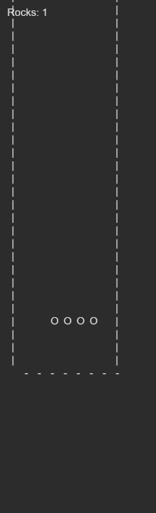

# Day 17 Visualizations

> **NOTE** Visualizations are often **spoilers** by their very nature.

## Visualizations

1. fast terminal GIF by [Reddit user Ok-Curve902](https://www.reddit.com/user/Ok-Curve902)
   ([permalink](https://www.reddit.com/r/adventofcode/comments/zoa17r/2022_day17/))

1. spreadsheet GIF by [Reddit user zero\_mod\_p](https://www.reddit.com/user/zero_mod_p)
   ([permalink](https://www.reddit.com/r/adventofcode/comments/zo1vb8/2022_day_17_part_1_python_spreadsheet_spreadsheet/))

1. nice "Elftris" terminal by [Reddit user p88h](https://www.reddit.com/user/p88h)
   ([permalink](https://www.reddit.com/r/adventofcode/comments/zo7fkx/2022_day_17_part_1_elftris/))

(see Reddit post for video)

1. clean visualization by [Reddit user Boojum](https://www.reddit.com/user/Boojum)
   ([permalink](https://www.reddit.com/r/adventofcode/comments/zo27vf/2022_day_17_part_2_rocks_fall_nobody_dies/))

(see Reddit post for video)

1. rocks in Unity by [Reddit user BBIT-Solutions](https://www.reddit.com/user/BBIT-Solutions)
   ([permalink](https://www.reddit.com/r/adventofcode/comments/zogoig/2022_day_17_part_1_and_2_c_unity_a_little/))

(see Reddit post for video)

1. Tetris game by [Reddit user naclmolecule](https://www.reddit.com/user/naclmolecule)
   ([permalink](https://www.reddit.com/r/adventofcode/comments/zob9rx/2022_day_17_python_playing_a_familiarish_game_in/))

## Comics

[Advent of Code comics](https://www.webtoons.com/en/challenge/advent-of-code/list?title_no=713188)
by [Fish N Chips UK](https://www.webtoons.com/en/creator/69q8f)

1. [Pyroclastic Flow](https://www.webtoons.com/en/challenge/advent-of-code/pyroclastic-flow/viewer?title_no=713188&episode_no=46)
